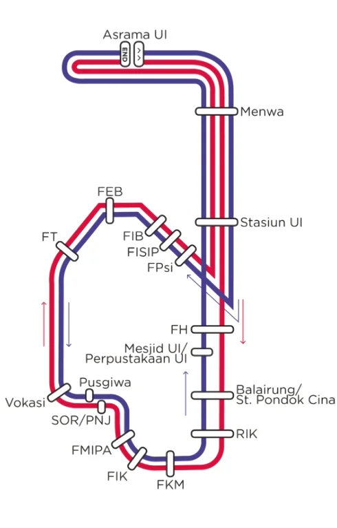
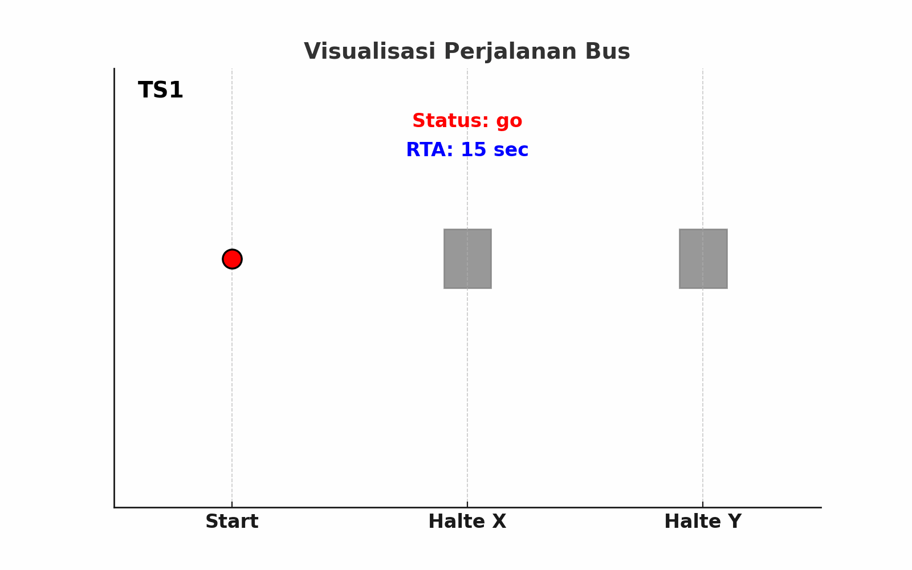

# Predicting Bikun ETA: A Data Science Approach to Campus Transportation

![Bis Kuning Illustration][https://www.google.com/url?sa=i&url=https%3A%2F%2Fmegapolitan.kompas.com%2Fread%2F2022%2F08%2F21%2F00400041%2Frute-bus-kuning-ui-&psig=AOvVaw3sgFSy1Y7yWpfhIamgoIzA&ust=1752551549311000&source=images&cd=vfe&opi=89978449&ved=0CBQQjRxqFwoTCMiattS5u44DFQAAAAAdAAAAABAE]

This project focuses on the implementation of a predictive model for the Estimated Time of Arrival (ETA) of the UI (Universitas Indonesia) Bikun (Yellow Bus). Leveraging advanced machine learning methodologies, this initiative showcases my proficiency in handling geospatial time-series data, applying sophisticated feature engineering, and developing robust models to address complex logistical challenges in urban transportation.

Providing accurate ETA is crucial for improving public transportation efficiency and user experience. Leveraging historical GPS data from the Bikun system, I developed a comprehensive framework to estimate arrival times to the nearest stop.

## Key Highlights

* **Innovative Feature Engineering:** Transformed raw GPS and speed data into meaningful features, including distance to stops and temporal patterns.
* **Custom RTA Generation:** Engineered a methodology to calculate Real Time Arrival (RTA) labels from raw timestamps, addressing the absence of target variables in the original dataset.
* **Robust Modeling with CatBoost:** Utilized `CatBoostRegressor` to develop a high-accuracy ETA prediction model, tackling the complexities of real-world urban transit.
* **Comprehensive Data Analysis:** Explored the Bikun travel patterns, identifying data characteristics that significantly impact arrival times.

## Project Structure

This repository is organized to guide you through the project's lifecycle, from initial analysis to model inference:

* **`Analysis_nb.ipynb`**: My exploratory data analysis (EDA) notebook, detailing insights and the feature engineering process.
* **`Inference_nb1.ipynb`** and **`Inference_nb2.ipynb`**: Notebooks demonstrating the complete pipeline, including data preprocessing, model training, and prediction generation.
* **`requirements.txt`**: The list of Python libraries required to run the notebooks.
* **`dataset/public/`**: Contains the raw input data files (`train.csv`, `test.csv`, `routes.json`, `jalanraya_ui_flowcoord.json`, `sample_submission.csv`).

## UI Bikun Route Map

The Bikun system operates on two main routes (Red and Blue) connecting various faculties and facilities across the UI campus.

## The Data and the Challenge

The dataset is derived from the historical travel logs of the UI Bikun from September 14, 2024, to September 27, 2024. The core challenge was transforming this data into a structured format for predictive modeling, particularly generating the RTA label.

### Data Overview

* **`train.csv` & `test.csv`**: Contains `ts` (timestamp), `lat`, `lon`, `speed`, and `color` (route type).
* **`routes.json`**: Stop coordinates for Red and Blue routes.
* **`jalanraya_ui_flowcoord.json`**: Coordinates defining the UI road network.

### RTA: Defining the Target Variable

Since the RTA (target variable) was missing, I engineered a method to derive it. RTA represents the time required to reach the next stop. A key insight applied here is that RTA only resets to 0 *exactly* when the bus is about to leave a stop for the next destination. While the bus is idle at a stop to pick up/drop off passengers, RTA continues to be counted (`> 0`). This nuanced approach ensures that the model accurately captures stop durations.

## Our Approach: Analysis, Feature Engineering, and Modeling

### Exploratory Data Analysis and Feature Engineering

Through thorough EDA (detailed in `Analysis_nb.ipynb`), I visualized the bus routes and identified data patterns, such as the high frequency of GPS logging and the correlation between speed and location.

I engineered robust features, including:

* **Geospatial Features:** Calculated distance to the nearest stop (`halte_distance`) to identify stops and estimate remaining travel time.
* **Temporal Features:** Extracted cyclical features from timestamps to capture time-based patterns in travel behavior.
* **Data Segmentation:** Recognizing varying travel characteristics, I segmented the data into 'Normal Route', 'Short Route', and 'Outside Flowcoord' groups.

### Modeling with CatBoost

I selected `CatBoostRegressor` for its efficiency and strong performance with structured data. By training separate CatBoost models for each data segment, I optimized the model's ability to handle different route characteristics.

The modeling process involved careful data cleaning, including removing RTA and speed outliers, to ensure a high-quality training dataset.

## Getting Started

To explore this project and run the notebooks:

1.  Clone the repository.
2.  Install dependencies using `requirements.txt`.
3.  Navigate through the Jupyter notebooks (`Analysis_nb.ipynb`, `Inference_nb*.ipynb`) to follow the data journey and reproduce the results.
